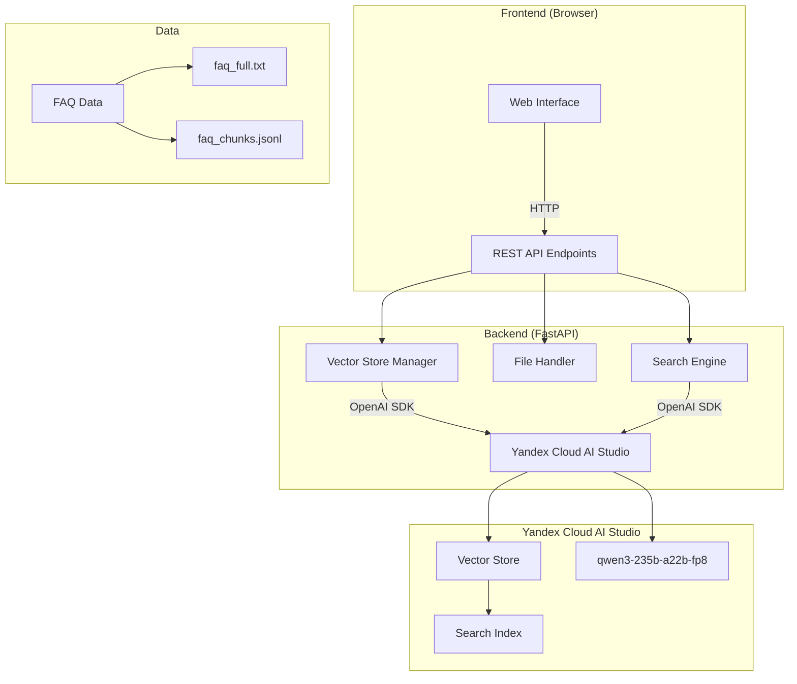
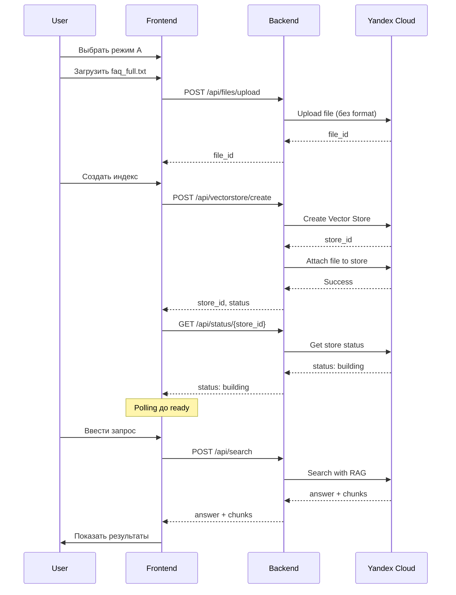
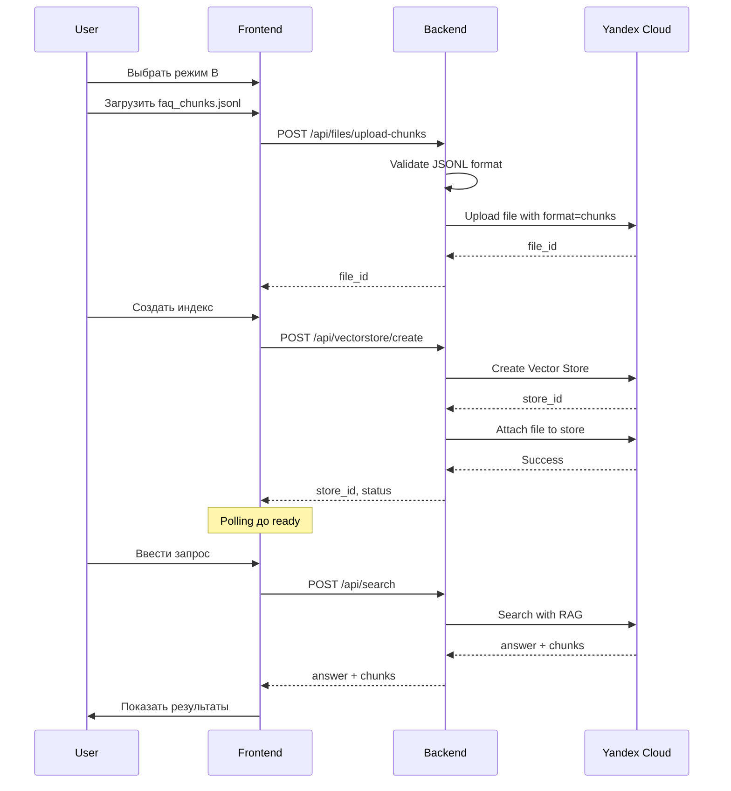

# Архитектура проекта AI Search Demo

## Обзор

Демонстрационное приложение для показа возможностей Yandex Cloud AI Studio Search с поддержкой двух режимов работы:
- **Режим A**: Автоматическое чанкование (платформа сама разбивает документ)
- **Режим B**: Пользовательские чанки (загрузка готовых чанков в формате JSONL)

## Технологический стек

### Backend
- **FastAPI** - веб-фреймворк для REST API
- **OpenAI SDK** - для работы с Yandex Cloud AI Studio API
- **Python 3.10+**
- **python-dotenv** - управление переменными окружения
- **pydantic** - валидация данных

### Frontend
- **Vanilla JavaScript** - без фреймворков для простоты
- **HTML5/CSS3** - современный адаптивный интерфейс
- **Fetch API** - для взаимодействия с backend

### Инфраструктура
- **Yandex Cloud AI Studio** - Vector Store и Search API
- **Модель**: `gpt://<folder_id>/qwen3-235b-a22b-fp8/latest`

## Архитектура системы



## Структура проекта

```
chunk_search/
├── backend/
│   ├── app/
│   │   ├── __init__.py
│   │   ├── main.py                 # FastAPI приложение
│   │   ├── config.py               # Конфигурация
│   │   ├── models.py               # Pydantic модели
│   │   └── services/
│   │       ├── __init__.py
│   │       ├── vectorstore.py      # Работа с Vector Store
│   │       ├── search.py           # Поиск и RAG
│   │       └── file_handler.py     # Обработка файлов
│   ├── requirements.txt
│   └── .env.example
├── frontend/
│   ├── index.html                  # Главная страница
│   ├── css/
│   │   └── styles.css              # Стили
│   └── js/
│       ├── app.js                  # Основная логика
│       ├── api.js                  # API клиент
│       └── ui.js                   # UI компоненты
├── data/
│   ├── faq_full.txt                # FAQ для автоматического чанкования
│   └── faq_chunks.jsonl            # Предварительно нарезанные чанки
├── docs/
│   ├── API.md                      # Документация API
│   └── BLUEPRINT.md                # Blueprint по шаблону
├── README.md
├── ARCHITECTURE.md                 # Этот файл
└── .gitignore
```

## Компоненты Backend

### 1. REST API Endpoints

#### Vector Store Management
- `POST /api/vectorstore/create` - создание нового Vector Store
- `GET /api/vectorstore/{store_id}` - получение информации о Vector Store
- `DELETE /api/vectorstore/{store_id}` - удаление Vector Store
- `GET /api/vectorstore/list` - список всех Vector Store

#### File Management
- `POST /api/files/upload` - загрузка файла (txt или jsonl)
- `POST /api/files/upload-chunks` - загрузка чанков (JSONL с format=chunks)
- `GET /api/files/{file_id}` - информация о файле
- `DELETE /api/files/{file_id}` - удаление файла

#### Search
- `POST /api/search` - выполнение поиска с RAG
- `POST /api/search/compare` - сравнение результатов двух индексов

#### Health & Status
- `GET /api/health` - проверка работоспособности
- `GET /api/status/{index_id}` - статус индекса

### 2. Vector Store Manager

Отвечает за работу с Vector Store API:

```python
class VectorStoreManager:
    def create_store(self, name: str) -> str
    def get_store(self, store_id: str) -> dict
    def delete_store(self, store_id: str) -> bool
    def list_stores(self) -> list
    def wait_for_ready(self, store_id: str, timeout: int) -> bool
```

### 3. File Handler

Обработка и загрузка файлов:

```python
class FileHandler:
    def upload_file(self, file_path: str, store_id: str) -> str
    def upload_chunks(self, jsonl_path: str, store_id: str) -> str
    def validate_jsonl(self, content: str) -> bool
    def parse_chunks(self, jsonl_content: str) -> list
```

### 4. Search Engine

Выполнение поиска и генерация ответов:

```python
class SearchEngine:
    def search(self, query: str, store_id: str, top_k: int = 5) -> dict
    def get_chunks_with_scores(self, query: str, store_id: str) -> list
    def generate_answer(self, query: str, context: str) -> str
```

## Компоненты Frontend

### 1. UI Components

#### Scenario Selector
- Переключатель между режимами A и B
- Визуальная индикация активного режима

#### Mode A: Auto-chunking
- Кнопка загрузки файла `faq_full.txt`
- Кнопка создания индекса
- Индикатор статуса индекса

#### Mode B: Custom Chunks
- Кнопка загрузки файла `faq_chunks.jsonl`
- Кнопка создания индекса
- Индикатор статуса индекса

#### Search Interface
- Поле ввода запроса
- Кнопка "Найти"
- Блок результатов:
  - Ответ модели
  - Список чанков с score
  - Подсветка релевантных фрагментов

#### Comparison View (опционально)
- Параллельное отображение результатов из обоих режимов
- Визуальное сравнение качества ответов

### 2. API Client

```javascript
class APIClient {
    async createVectorStore(name)
    async uploadFile(file, storeId, format)
    async getStoreStatus(storeId)
    async search(query, storeId)
    async compareSearch(query, storeIdA, storeIdB)
}
```

### 3. State Management

```javascript
class AppState {
    currentMode: 'auto' | 'custom'
    autoModeStore: { id, status, fileId }
    customModeStore: { id, status, fileId }
    searchResults: { answer, chunks }
}
```

## Формат данных

### FAQ Full Text (faq_full.txt)

```
Вопрос: Можно ли работать с Yandex Cloud AI без интернета?
Ответ: Нет, для работы с Yandex Cloud AI Studio требуется постоянное подключение к интернету...

Вопрос: Какие модели доступны в AI Studio?
Ответ: В Yandex Cloud AI Studio доступны следующие модели...
```

### FAQ Chunks (faq_chunks.jsonl)

```jsonl
{"id": "faq_offline_mode", "body": "Вопрос: Можно ли работать с Yandex Cloud AI без интернета?\nОтвет: Нет, для работы с Yandex Cloud AI Studio требуется постоянное подключение к интернету, так как все вычисления происходят в облаке."}
{"id": "faq_available_models", "body": "Вопрос: Какие модели доступны в AI Studio?\nОтвет: В Yandex Cloud AI Studio доступны следующие модели: YandexGPT, YandexGPT-Lite, qwen3-235b и другие."}
```

## Потоки данных

### Сценарий 1: Автоматическое чанкование



### Сценарий 2: Пользовательские чанки



## Конфигурация

### Environment Variables (.env)

```bash
# Yandex Cloud
YC_API_KEY=your_api_key_here
YC_FOLDER_ID=your_folder_id_here

# AI Studio
YC_AI_STUDIO_BASE_URL=https://api.yandex-cloud.ru/ai-studio/v1
YC_MODEL_URI=gpt://{folder_id}/qwen3-235b-a22b-fp8/latest

# Application
APP_HOST=0.0.0.0
APP_PORT=8000
DEBUG=true

# Search Settings
DEFAULT_TOP_K=5
MAX_CHUNK_SIZE=1000
```

### OpenAI SDK Configuration

```python
from openai import OpenAI

client = OpenAI(
    api_key=os.getenv("YC_API_KEY"),
    base_url=os.getenv("YC_AI_STUDIO_BASE_URL")
)
```

## Обработка ошибок

### Backend Error Handling

```python
class APIError(Exception):
    def __init__(self, status_code: int, message: str):
        self.status_code = status_code
        self.message = message

@app.exception_handler(APIError)
async def api_error_handler(request, exc):
    return JSONResponse(
        status_code=exc.status_code,
        content={"error": exc.message}
    )
```

### Frontend Error Handling

```javascript
async function handleAPICall(apiFunction) {
    try {
        return await apiFunction();
    } catch (error) {
        if (error.response) {
            showError(`API Error: ${error.response.data.error}`);
        } else {
            showError(`Network Error: ${error.message}`);
        }
        throw error;
    }
}
```

## Безопасность

1. **API Key Protection**
   - Хранение в `.env` файле
   - Не коммитить в git (`.gitignore`)
   - Использование переменных окружения

2. **CORS Configuration**
   - Настройка разрешенных origins
   - Ограничение методов и заголовков

3. **Input Validation**
   - Валидация JSONL формата
   - Проверка размера файлов
   - Санитизация пользовательского ввода

4. **Rate Limiting**
   - Ограничение количества запросов
   - Защита от DDoS

## Производительность

1. **Асинхронность**
   - Использование async/await в FastAPI
   - Неблокирующие операции I/O

2. **Кэширование**
   - Кэширование статуса индексов
   - Кэширование результатов поиска (опционально)

3. **Оптимизация запросов**
   - Batch операции где возможно
   - Минимизация количества API вызовов

## Мониторинг и логирование

```python
import logging

logging.basicConfig(
    level=logging.INFO,
    format='%(asctime)s - %(name)s - %(levelname)s - %(message)s'
)

logger = logging.getLogger(__name__)

# Логирование ключевых операций
logger.info(f"Creating vector store: {name}")
logger.error(f"Failed to upload file: {error}")
```

## Тестирование

### Unit Tests
- Тестирование сервисов изолированно
- Моки для Yandex Cloud API

### Integration Tests
- Тестирование полного потока
- Реальные вызовы API (в тестовом окружении)

### E2E Tests
- Тестирование через UI
- Selenium/Playwright для автоматизации

## Развертывание

### Local Development
```bash
# Backend
cd backend
python -m venv venv
source venv/bin/activate
pip install -r requirements.txt
uvicorn app.main:app --reload

# Frontend
cd frontend
python -m http.server 8080
```

### Production
- Docker контейнеризация
- Nginx для статики
- Gunicorn для FastAPI
- Systemd для управления процессами

## Метрики успеха

1. **Функциональность**
   - ✅ Оба режима работают корректно
   - ✅ Поиск возвращает релевантные результаты
   - ✅ UI интуитивно понятен

2. **Качество ответов**
   - ✅ Режим B дает более точные ответы
   - ✅ Чанки сохраняют логическую целостность
   - ✅ Score корректно отражает релевантность

3. **Производительность**
   - ✅ Создание индекса < 2 минут
   - ✅ Поиск < 3 секунд
   - ✅ UI отзывчив

## Дальнейшее развитие

1. **Функциональность**
   - Поддержка других форматов (PDF, DOCX)
   - Batch загрузка файлов
   - История поисковых запросов

2. **UI/UX**
   - Визуализация чанков
   - Подсветка совпадений
   - Экспорт результатов

3. **Аналитика**
   - Метрики качества поиска
   - A/B тестирование режимов
   - Дашборд с аналитикой