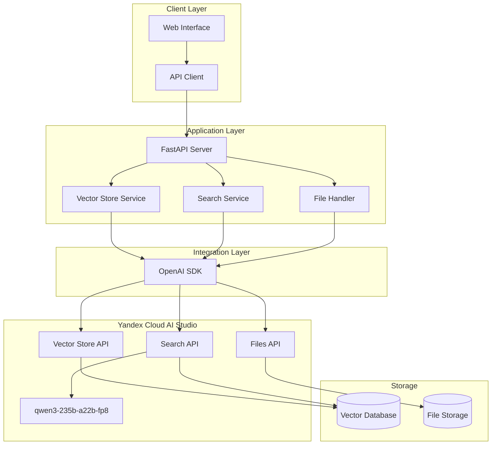

# Blueprint: AI Search с пользовательскими чанками

## Метаданные

- **Название**: AI Search Demo - Custom Chunks
- **Версия**: 1.0.0
- **Дата создания**: 2026-01-26
- **Автор**: Yandex Cloud AI Team
- **Статус**: В разработке

## 1. Описание решения

### 1.1 Бизнес-контекст

**Проблема**: При использовании автоматического чанкования в RAG-системах часто теряется логическая связность документов. Например, в FAQ вопрос и ответ могут попасть в разные чанки, что снижает качество поиска и ответов модели.

**Решение**: Предоставить возможность загружать предварительно подготовленные чанки в формате JSONL, где каждый чанк представляет логически завершенную единицу информации (например, пара вопрос-ответ).

**Ценность для клиента**:
- Полный контроль над структурой данных в RAG
- Повышение точности и релевантности ответов
- Сохранение логической целостности документов
- Гибкость в организации знаний

### 1.2 Целевая аудитория

- **Разработчики**: интегрируют AI Search в свои приложения
- **Data Engineers**: готовят и структурируют данные для RAG
- **Product Managers**: оценивают возможности платформы
- **Клиенты Yandex Cloud**: используют AI Studio для своих задач

### 1.3 Сценарии использования

#### Сценарий 1: FAQ система
**Актор**: Разработчик корпоративного портала  
**Цель**: Создать точную систему ответов на вопросы сотрудников  
**Шаги**:
1. Подготовить FAQ в формате JSONL (каждый Q&A - отдельный чанк)
2. Загрузить чанки через API с `format=chunks`
3. Создать Search Index
4. Интегрировать поиск в корпоративный портал

**Результат**: Сотрудники получают точные ответы, вопрос и ответ всегда в одном контексте

#### Сценарий 2: Юридические документы
**Актор**: Legal Tech компания  
**Цель**: Создать систему поиска по законодательству  
**Шаги**:
1. Разбить законы на статьи (каждая статья - чанк)
2. Загрузить через JSONL с сохранением структуры
3. Создать индекс для поиска
4. Предоставить API для юридических консультаций

**Результат**: Поиск возвращает целые статьи, а не фрагменты текста

#### Сценарий 3: Техническая документация
**Актор**: DevRel команда  
**Цель**: Создать AI-ассистента для разработчиков  
**Шаги**:
1. Структурировать документацию по разделам
2. Каждый раздел/пример кода - отдельный чанк
3. Загрузить в AI Search
4. Создать чат-бота для помощи разработчикам

**Результат**: Разработчики получают полные примеры кода и инструкции

## 2. Архитектура решения

### 2.1 Компонентная диаграмма



### 2.2 Технологический стек

| Компонент | Технология | Обоснование |
|-----------|-----------|-------------|
| Backend Framework | FastAPI | Высокая производительность, async/await, автогенерация OpenAPI |
| Frontend | Vanilla JS | Простота, нет зависимостей, быстрая загрузка |
| AI Platform | Yandex Cloud AI Studio | Целевая платформа для демо |
| SDK | OpenAI Python SDK | Совместимость с AI Studio API |
| Model | qwen3-235b-a22b-fp8 | Высокое качество ответов, оптимизация |
| Data Format | JSONL | Стандарт для streaming data, простота парсинга |

### 2.3 API Endpoints

#### Vector Store Management
```
POST   /api/vectorstore/create
GET    /api/vectorstore/{store_id}
DELETE /api/vectorstore/{store_id}
GET    /api/vectorstore/list
```

#### File Operations
```
POST   /api/files/upload
POST   /api/files/upload-chunks
GET    /api/files/{file_id}
DELETE /api/files/{file_id}
```

#### Search
```
POST   /api/search
POST   /api/search/compare
```

#### System
```
GET    /api/health
GET    /api/status/{index_id}
```

### 2.4 Формат данных

#### JSONL для пользовательских чанков
```jsonl
{"id": "unique_chunk_id", "body": "Полный текст чанка"}
```

**Требования**:
- Каждая строка - валидный JSON объект
- Обязательные поля: `id`, `body`
- `id` - уникальный идентификатор чанка
- `body` - текстовое содержимое чанка
- Максимальный размер чанка: определяется моделью

#### Пример FAQ чанка
```json
{
  "id": "faq_offline_mode",
  "body": "Вопрос: Можно ли работать с Yandex Cloud AI без интернета?\n\nОтвет: Нет, для работы с Yandex Cloud AI Studio требуется постоянное подключение к интернету, так как все вычисления происходят в облаке. Модели и данные хранятся на серверах Yandex Cloud, и для выполнения запросов необходим доступ к API."
}
```

## 3. Реализация

### 3.1 Структура проекта

```
chunk_search/
├── backend/
│   ├── app/
│   │   ├── main.py              # FastAPI приложение
│   │   ├── config.py            # Конфигурация
│   │   ├── models.py            # Pydantic модели
│   │   └── services/
│   │       ├── vectorstore.py   # Vector Store операции
│   │       ├── search.py        # Поиск и RAG
│   │       └── file_handler.py  # Работа с файлами
│   └── requirements.txt
├── frontend/
│   ├── index.html
│   ├── css/styles.css
│   └── js/
│       ├── app.js               # Основная логика
│       ├── api.js               # API клиент
│       └── ui.js                # UI компоненты
├── data/
│   ├── faq_full.txt             # Для автоматического чанкования
│   └── faq_chunks.jsonl         # Пользовательские чанки
└── docs/
    ├── API.md
    └── BLUEPRINT.md
```

### 3.2 Ключевые компоненты

#### Backend: Vector Store Service
```python
class VectorStoreService:
    """Управление Vector Store в Yandex Cloud AI Studio"""
    
    def __init__(self, client: OpenAI):
        self.client = client
    
    async def create_store(self, name: str) -> str:
        """Создать новый Vector Store"""
        response = self.client.vector_stores.create(name=name)
        return response.id
    
    async def upload_file(
        self, 
        file_path: str, 
        store_id: str,
        format: str = None
    ) -> str:
        """Загрузить файл в Vector Store"""
        extra_body = {"format": format} if format else {}
        
        with open(file_path, "rb") as f:
            response = self.client.files.create(
                file=f,
                purpose="assistants",
                extra_body=extra_body
            )
        
        # Прикрепить файл к Vector Store
        self.client.vector_stores.files.create(
            vector_store_id=store_id,
            file_id=response.id
        )
        
        return response.id
    
    async def wait_for_ready(
        self, 
        store_id: str, 
        timeout: int = 300
    ) -> bool:
        """Ожидать готовности индекса"""
        start_time = time.time()
        
        while time.time() - start_time < timeout:
            store = self.client.vector_stores.retrieve(store_id)
            
            if store.status == "completed":
                return True
            elif store.status == "failed":
                raise Exception("Index building failed")
            
            await asyncio.sleep(5)
        
        raise TimeoutError("Index building timeout")
```

#### Backend: Search Service
```python
class SearchService:
    """Поиск с использованием RAG"""
    
    def __init__(self, client: OpenAI, model_uri: str):
        self.client = client
        self.model_uri = model_uri
    
    async def search(
        self, 
        query: str, 
        store_id: str,
        top_k: int = 5
    ) -> dict:
        """Выполнить поиск и получить ответ"""
        
        # Получить релевантные чанки
        chunks = await self._get_chunks(query, store_id, top_k)
        
        # Сформировать контекст
        context = "\n\n".join([
            f"[Чанк {i+1}, score: {c['score']:.3f}]\n{c['body']}"
            for i, c in enumerate(chunks)
        ])
        
        # Сгенерировать ответ
        answer = await self._generate_answer(query, context)
        
        return {
            "answer": answer,
            "chunks": chunks,
            "query": query
        }
    
    async def _get_chunks(
        self, 
        query: str, 
        store_id: str,
        top_k: int
    ) -> list:
        """Получить релевантные чанки"""
        # Используем Search API
        response = self.client.vector_stores.search(
            vector_store_id=store_id,
            query=query,
            limit=top_k
        )
        
        return [
            {
                "id": item.id,
                "body": item.content,
                "score": item.score
            }
            for item in response.data
        ]
    
    async def _generate_answer(
        self, 
        query: str, 
        context: str
    ) -> str:
        """Сгенерировать ответ на основе контекста"""
        prompt = f"""На основе предоставленного контекста ответь на вопрос.

Контекст:
{context}

Вопрос: {query}

Ответ:"""
        
        response = self.client.chat.completions.create(
            model=self.model_uri,
            messages=[
                {"role": "user", "content": prompt}
            ]
        )
        
        return response.choices[0].message.content
```

#### Frontend: API Client
```javascript
class APIClient {
    constructor(baseURL = 'http://localhost:8000') {
        this.baseURL = baseURL;
    }
    
    async createVectorStore(name) {
        const response = await fetch(`${this.baseURL}/api/vectorstore/create`, {
            method: 'POST',
            headers: {'Content-Type': 'application/json'},
            body: JSON.stringify({name})
        });
        return await response.json();
    }
    
    async uploadFile(file, storeId, format = null) {
        const formData = new FormData();
        formData.append('file', file);
        formData.append('store_id', storeId);
        if (format) formData.append('format', format);
        
        const response = await fetch(`${this.baseURL}/api/files/upload`, {
            method: 'POST',
            body: formData
        });
        return await response.json();
    }
    
    async search(query, storeId) {
        const response = await fetch(`${this.baseURL}/api/search`, {
            method: 'POST',
            headers: {'Content-Type': 'application/json'},
            body: JSON.stringify({query, store_id: storeId})
        });
        return await response.json();
    }
    
    async getStoreStatus(storeId) {
        const response = await fetch(
            `${this.baseURL}/api/status/${storeId}`
        );
        return await response.json();
    }
}
```

### 3.3 Конфигурация

#### Environment Variables
```bash
# Yandex Cloud
YC_API_KEY=your_api_key_here
YC_FOLDER_ID=your_folder_id_here

# AI Studio
YC_AI_STUDIO_BASE_URL=https://api.yandex-cloud.ru/ai-studio/v1
YC_MODEL_URI=gpt://{folder_id}/qwen3-235b-a22b-fp8/latest

# Application
APP_HOST=0.0.0.0
APP_PORT=8000
DEBUG=true

# Search
DEFAULT_TOP_K=5
```

## 4. Развертывание

### 4.1 Локальная разработка

```bash
# 1. Клонировать репозиторий
git clone <repository_url>
cd chunk_search

# 2. Настроить backend
cd backend
python -m venv venv
source venv/bin/activate  # Windows: venv\Scripts\activate
pip install -r requirements.txt

# 3. Настроить переменные окружения
cp .env.example .env
# Отредактировать .env с вашими credentials

# 4. Запустить backend
uvicorn app.main:app --reload --port 8000

# 5. Запустить frontend (в новом терминале)
cd ../frontend
python -m http.server 8080

# 6. Открыть в браузере
# http://localhost:8080
```

### 4.2 Production

#### Docker Compose
```yaml
version: '3.8'

services:
  backend:
    build: ./backend
    ports:
      - "8000:8000"
    environment:
      - YC_API_KEY=${YC_API_KEY}
      - YC_FOLDER_ID=${YC_FOLDER_ID}
    restart: unless-stopped
  
  frontend:
    image: nginx:alpine
    ports:
      - "80:80"
    volumes:
      - ./frontend:/usr/share/nginx/html
      - ./nginx.conf:/etc/nginx/nginx.conf
    depends_on:
      - backend
    restart: unless-stopped
```

## 5. Тестирование

### 5.1 Приемочные тесты

#### Тест 1: Создание индекса с пользовательскими чанками
```python
async def test_create_custom_chunks_index():
    # Arrange
    chunks_file = "data/faq_chunks.jsonl"
    store_name = "test_custom_chunks"
    
    # Act
    store_id = await vectorstore_service.create_store(store_name)
    file_id = await vectorstore_service.upload_file(
        chunks_file, 
        store_id, 
        format="chunks"
    )
    ready = await vectorstore_service.wait_for_ready(store_id)
    
    # Assert
    assert ready == True
    assert store_id is not None
    assert file_id is not None
```

#### Тест 2: Поиск в индексе с пользовательскими чанками
```python
async def test_search_custom_chunks():
    # Arrange
    query = "Можно ли работать без интернета?"
    store_id = "existing_store_id"
    
    # Act
    result = await search_service.search(query, store_id)
    
    # Assert
    assert "answer" in result
    assert "chunks" in result
    assert len(result["chunks"]) > 0
    assert result["chunks"][0]["id"] == "faq_offline_mode"
    assert result["chunks"][0]["score"] > 0.7
```

#### Тест 3: Сравнение режимов
```python
async def test_compare_modes():
    # Arrange
    query = "Можно ли работать без интернета?"
    auto_store_id = "auto_chunks_store"
    custom_store_id = "custom_chunks_store"
    
    # Act
    auto_result = await search_service.search(query, auto_store_id)
    custom_result = await search_service.search(query, custom_store_id)
    
    # Assert
    # Пользовательские чанки должны дать более высокий score
    assert custom_result["chunks"][0]["score"] > auto_result["chunks"][0]["score"]
    
    # Ответ должен быть более релевантным
    assert "интернет" in custom_result["answer"].lower()
```

### 5.2 Метрики качества

| Метрика | Целевое значение | Измерение |
|---------|------------------|-----------|
| Точность поиска (Precision@5) | > 0.8 | Доля релевантных чанков в топ-5 |
| Полнота (Recall@5) | > 0.7 | Доля найденных релевантных чанков |
| Время создания индекса | < 2 мин | Для 100 чанков |
| Время поиска | < 3 сек | От запроса до ответа |
| Релевантность ответа | > 4/5 | Экспертная оценка |

## 6. Мониторинг и поддержка

### 6.1 Логирование

```python
import logging

logging.basicConfig(
    level=logging.INFO,
    format='%(asctime)s - %(name)s - %(levelname)s - %(message)s',
    handlers=[
        logging.FileHandler('app.log'),
        logging.StreamHandler()
    ]
)

logger = logging.getLogger(__name__)

# Примеры логирования
logger.info(f"Creating vector store: {name}")
logger.error(f"Failed to upload file: {error}", exc_info=True)
logger.warning(f"Index building timeout: {store_id}")
```

### 6.2 Метрики

```python
from prometheus_client import Counter, Histogram

# Счетчики
search_requests = Counter('search_requests_total', 'Total search requests')
index_creations = Counter('index_creations_total', 'Total index creations')

# Гистограммы
search_duration = Histogram('search_duration_seconds', 'Search duration')
index_build_duration = Histogram('index_build_duration_seconds', 'Index build duration')

# Использование
@search_duration.time()
async def search(query, store_id):
    search_requests.inc()
    # ... поиск
```

### 6.3 Health Checks

```python
@app.get("/api/health")
async def health_check():
    try:
        # Проверка подключения к AI Studio
        client.vector_stores.list(limit=1)
        
        return {
            "status": "healthy",
            "timestamp": datetime.utcnow().isoformat(),
            "services": {
                "ai_studio": "up",
                "api": "up"
            }
        }
    except Exception as e:
        return {
            "status": "unhealthy",
            "error": str(e)
        }, 503
```

## 7. Документация

### 7.1 API Documentation

FastAPI автоматически генерирует OpenAPI документацию:
- Swagger UI: `http://localhost:8000/docs`
- ReDoc: `http://localhost:8000/redoc`
- OpenAPI JSON: `http://localhost:8000/openapi.json`

### 7.2 Пользовательская документация

#### Быстрый старт
1. Подготовьте данные в формате JSONL
2. Загрузите файл через UI
3. Создайте индекс
4. Выполните поиск

#### Формат JSONL
```jsonl
{"id": "chunk_1", "body": "Текст первого чанка"}
{"id": "chunk_2", "body": "Текст второго чанка"}
```

#### Примеры запросов
```bash
# Создать Vector Store
curl -X POST http://localhost:8000/api/vectorstore/create \
  -H "Content-Type: application/json" \
  -d '{"name": "my_store"}'

# Загрузить чанки
curl -X POST http://localhost:8000/api/files/upload-chunks \
  -F "file=@faq_chunks.jsonl" \
  -F "store_id=store_123"

# Выполнить поиск
curl -X POST http://localhost:8000/api/search \
  -H "Content-Type: application/json" \
  -d '{"query": "Как работать с API?", "store_id": "store_123"}'
```

## 8. Безопасность

### 8.1 Аутентификация и авторизация

```python
from fastapi import Security, HTTPException
from fastapi.security import HTTPBearer, HTTPAuthorizationCredentials

security = HTTPBearer()

async def verify_token(
    credentials: HTTPAuthorizationCredentials = Security(security)
):
    if credentials.credentials != os.getenv("API_TOKEN"):
        raise HTTPException(status_code=401, detail="Invalid token")
    return credentials.credentials

@app.post("/api/search")
async def search(
    request: SearchRequest,
    token: str = Depends(verify_token)
):
    # ... поиск
```

### 8.2 Валидация входных данных

```python
from pydantic import BaseModel, validator

class ChunkUploadRequest(BaseModel):
    store_id: str
    
    @validator('store_id')
    def validate_store_id(cls, v):
        if not v or len(v) < 10:
            raise ValueError('Invalid store_id')
        return v

class SearchRequest(BaseModel):
    query: str
    store_id: str
    top_k: int = 5
    
    @validator('query')
    def validate_query(cls, v):
        if not v or len(v) < 3:
            raise ValueError('Query too short')
        if len(v) > 1000:
            raise ValueError('Query too long')
        return v
    
    @validator('top_k')
    def validate_top_k(cls, v):
        if v < 1 or v > 20:
            raise ValueError('top_k must be between 1 and 20')
        return v
```

### 8.3 Rate Limiting

```python
from slowapi import Limiter, _rate_limit_exceeded_handler
from slowapi.util import get_remote_address

limiter = Limiter(key_func=get_remote_address)
app.state.limiter = limiter
app.add_exception_handler(RateLimitExceeded, _rate_limit_exceeded_handler)

@app.post("/api/search")
@limiter.limit("10/minute")
async def search(request: Request, search_request: SearchRequest):
    # ... поиск
```

## 9. Roadmap

### Версия 1.0 (MVP)
- ✅ Базовая функциональность загрузки чанков
- ✅ Создание индексов
- ✅ Поиск с RAG
- ✅ Простой UI

### Версия 1.1
- [ ] Batch загрузка файлов
- [ ] История поисковых запросов
- [ ] Экспорт результатов
- [ ] Улучшенная визуализация чанков

### Версия 2.0
- [ ] Поддержка PDF/DOCX
- [ ] Автоматическая генерация чанков с настройками
- [ ] A/B тестирование стратегий чанкования
- [ ] Аналитический дашборд

### Версия 3.0
- [ ] Multi-tenancy
- [ ] Продвинутая аналитика
- [ ] Интеграция с внешними системами
- [ ] Кастомизация моделей

## 10. FAQ

### Q: Какой максимальный размер чанка?
A: Зависит от модели. Для qwen3-235b рекомендуется до 2000 токенов (~1500 слов).

### Q: Можно ли обновить чанки после создания индекса?
A: Да, можно удалить старый файл и загрузить новый. Индекс обновится автоматически.

### Q: Как выбрать оптимальный размер чанка?
A: Зависит от типа данных:
- FAQ: один Q&A = один чанк
- Документация: один раздел = один чанк
- Код: одна функция/класс = один чанк

### Q: Поддерживаются ли метаданные в чанках?
A: В текущей версии только `id` и `body`. Метаданные планируются в версии 2.0.

### Q: Как мониторить качество поиска?
A: Используйте метрики Precision@K и Recall@K, а также экспертную оценку ответов.

## 11. Контакты и поддержка

- **Документация**: https://yandex.cloud/ru/docs/ai-studio
- **Техподдержка**: support@yandex-cloud.ru
- **Сообщество**: https://t.me/yandex_cloud_ai
- **Issues**: GitHub Issues в репозитории проекта

## 12. Лицензия

MIT License - см. файл LICENSE в корне проекта.